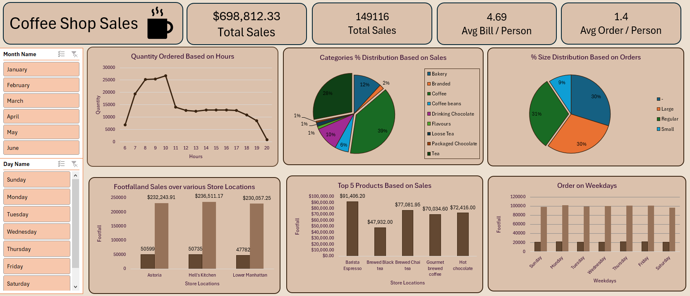

# ☕ Coffee Shop Sales Dashboard — Excel

An interactive sales dashboard built in Microsoft Excel analyzing coffee shop transactions across 3 store locations. The dashboard includes dynamic slicers for filtering by month and day, giving stakeholders a real-time view of business performance.

---

## 📌 Project Overview

The main objective of this project is to analyze retail sales data to gain actionable insights that will enhance the performance of the Coffee Shop. All analysis and visualization was done entirely in Microsoft Excel using Pivot Tables and Pivot Charts.

---

## ❓ Business Questions Answered

- How do sales vary by day of the week and hour of the day?
- Are there any peak times for sales activity?
- What is the total sales revenue for each month?
- How do sales vary across different store locations?
- What is the average price/order per person?
- Which products are the best-selling in terms of quantity and revenue?
- How do sales vary by product category and type?

---

## 🗂️ Dataset

- **Source:** Coffee Shop Sales Dataset — Kaggle
- **Coverage:** January to June (6 months)
- **Stores:** 3 locations — Astoria, Hell's Kitchen, Lower Manhattan

---

## 🛠️ Tools & Technologies

| Tool | Purpose |
|------|---------|
| Microsoft Excel | Data cleaning, analysis & dashboard |
| Pivot Tables | Data aggregation and summarization |
| Pivot Charts | Visual representation of KPIs |
| Slicers | Interactive filtering by month and day |

---

## 📊 Dashboard Features

- **KPI Cards** — Total Revenue, Total Orders, Avg Bill/Person, Avg Orders/Person
- **Quantity Ordered by Hour** — Line chart showing peak and off-peak hours
- **Category % Distribution** — Pie chart breaking down sales by product category
- **Size Distribution** — Pie chart showing order size preferences (Large, Regular, Small)
- **Footfall & Sales by Store Location** — Bar chart comparing all 3 stores
- **Top 5 Products by Sales** — Bar chart of best-selling products by revenue
- **Orders by Weekday** — Bar chart showing busiest days of the week
- **Interactive Slicers** — Filter entire dashboard by Month Name and Day Name

---

## 🔍 Key Insights

- **Total revenue of $698,812** was generated across 149,116 orders over 6 months
- **Average bill per person is $4.69** with an average of 1.4 orders per visit
- **Peak ordering hours are 9–10 AM**, with quantity dropping steadily after 11 AM — a classic morning coffee rush pattern
- **Coffee dominates at 39%** of category sales, followed by Tea (28%) and Branded products (12%)
- **Hell's Kitchen leads in sales** at $236,511, closely followed by Astoria ($232,243) and Lower Manhattan ($230,057) — all three locations perform very similarly
- **Barista Espresso is the #1 product** at $91,406 in sales, followed by Brewed Black Tea ($77,081) and Brewed Chai Tea ($70,034)
- **Regular and Large sizes are equally popular** at 30% each, with Small at 9%
- **Weekdays (Monday–Friday) drive the majority of orders**, with Sunday being the slowest day

---

## 📁 Project Structure

```
Coffee-Shop-Sales/
│
├── CoffeeShopSales.xlsx       # Raw data + Pivot Tables + Dashboard
├── Dashboard.png              # Screenshot of the final dashboard
├── Project_Report.pdf         # Full project report with objectives & analysis questions
└── README.md
```

---

## 📸 Dashboard Preview



---

## 📄 Project Report

A detailed project report (`Project_Report.pdf`) is included in this repository. It covers the project objective, the business questions that guided the analysis, and the analytical approach used to answer them.

---

## 🚀 How to Use

1. Clone or download this repository
2. Open `CoffeeShopSales.xlsx` in Microsoft Excel
3. Navigate to the **Dashboard** sheet
4. Use the **Month Name** and **Day Name** slicers on the left to filter all charts interactively

---

## 👩‍💻 Author

**Iqra Hasnain** — Aspiring Data Scientist  
[GitHub](https://github.com/IqraHasnain)
